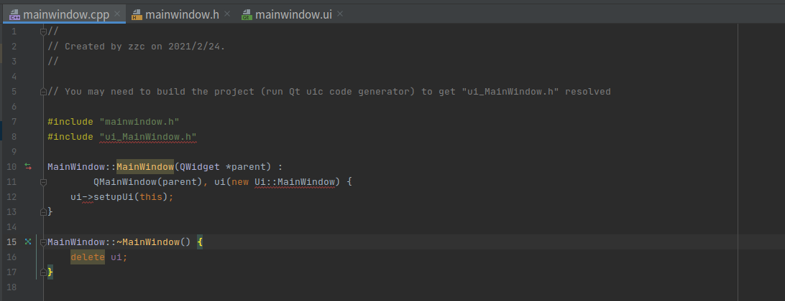

# Clion 创建 Qt UI Class 踩坑

## 注意 UI 类名和文件名关系

创建 UI 类 MainWindow；文件标红，按照提示先 build 一下



build 报错


**所以新建 UI 类的时候要确保 Name 和 Filename base 大小写要保持一致**


## 使用 Qt Designer 无法拖拽控件到 Window

**原因**

对比使用 Qt Creator 直接创建的 ui 文件，发现 clion 创建的缺少了 ‘\<widget class="QWidget" name="centralWidget"/\>’，窗体里面无法承载其他控件

**解决方案**

File -> setting -> Editor -> File and Code Template，找到 Qt Designer Form；添加如下语句

```velocity
    #if( 'QMainWindow' == ${PARENT_CLASS} )
    <widget class="QWidget" name="centralWidget"/>
    #end
```

添加后的 Qt Designer Form

```velocity
<?xml version="1.0" encoding="UTF-8"?>
<ui version="4.0">
  <author/>
  <comment/>
  <exportmacro/>
  <class>${NAME}</class>
  <widget class="${PARENT_CLASS}" name="${NAME}">
    <property name="geometry">
      <rect>
        <x>0</x>
        <y>0</y>
        <width>400</width>
        <height>300</height>
      </rect>
    </property>
    <property name="windowTitle">
      <string>${NAME}</string>
    </property>
    #if( 'QMainWindow' == ${PARENT_CLASS} )
    <widget class="QWidget" name="centralWidget"/>
    #end
  </widget>
  <pixmapfunction/>
  <connections/>
</ui>
```


<p align="right" style="padding-top:40px"><a href="https://zcteo.github.io/">回到首页</a></p>

