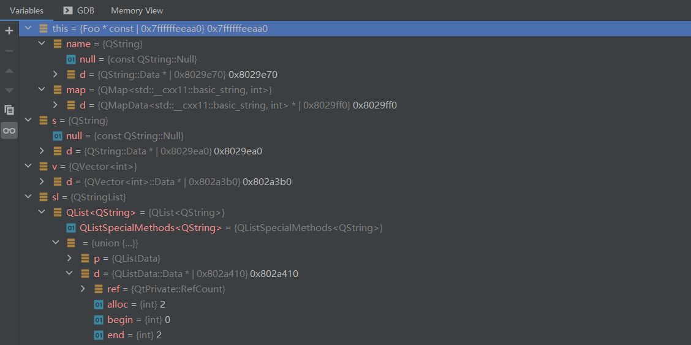
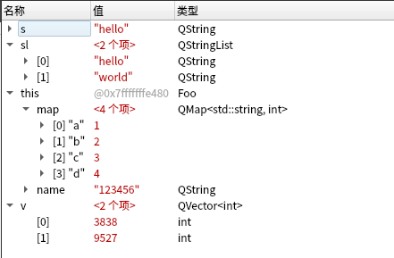
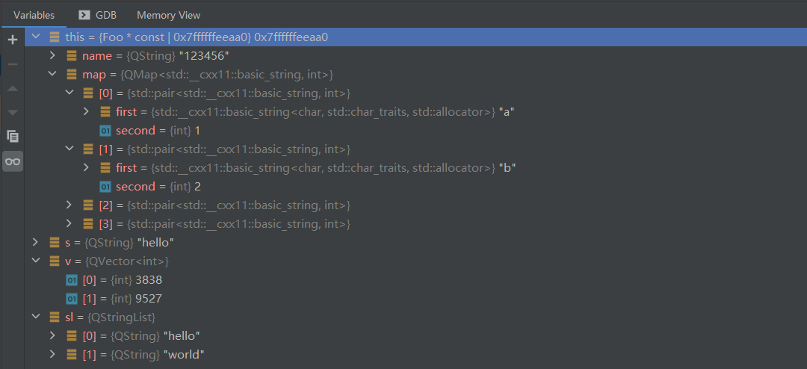

# 配置 Clion 调试显示 Qt 变量

[toc]

## 引言

众所周知，Clion 写 C++ 是真的爽，但是写 QT 是 2020.3 及其以后版本官方才做了一定的支持，但是调试过程中还是看不到 QT 变量，只能看到 d 指针地址，不信你看 :point_down::point_down::point_down:



使用 Qt Creator 的时候就就能看到里面的值




## 尝试解决

不是吧，不是吧，地球第一 IDE 居然不能调试 QT？那大家都别玩了。

谷歌搜索了一下，搜到这个地方<https://youtrack.jetbrains.com/issue/CPP-605>，那瞬间豁然开朗，至少有人遇到同样的问题，而且还讨论得热火朝天，那就有的玩。

顺着上面的讨论就找到了Clion官方指南 <https://www.jetbrains.com/help/clion/qt-tutorial.html#debug-renderers>


## 配置

### Lekensteyn's qt5printers

最开始在其他地方好像也见过这个，所以就先试试这个，根据它的 README 操作，那是分分钟就搞定了

这是 github 链接：<https://github.com/Lekensteyn/qt5printers>


### KDevelop formatters for GDB

之前那个遇到了一点问题，就转向大名鼎鼎的 KDE 试试（结果 KDE 也有问题）

打开 KDE 的相关脚本路径：<https://github.com/KDE/kdevelop/tree/master/plugins/gdb/printers>

因为只用到了 qt，没有用 KDE 的相关库，所以只下载了 [qt.py](https://github.com/KDE/kdevelop/blob/master/plugins/gdb/printers/qt.py) 和 [helper.py](https://github.com/KDE/kdevelop/blob/master/plugins/gdb/printers/helper.py)

将这两个文件放入 `~/.gdb/kdeprinters/` 文件夹，模仿上一个

修改或者新建 `~/.gdbinit` 文件，内容如下

```python
python
import sys, os.path
sys.path.insert(0, os.path.expanduser('~/.gdb/kdeprinters/'))
from qt import register_qt_printers
register_qt_printers (None)
end
```


### 配置完成之后的效果

这个看起来就 very good 了




## 问题及解决

本来以为一切都很正常的，但是直到 QMap 里面放了一个自定义类的指针之后，一切就都有问题了，调试返回不了正常数据了，甚至还会报错，这可适得其反了，啥也没了。开始还以为是 Lekensteyn's qt5printers 写得有问题，就又去折腾了 KDE 的，结果 KDE 也有同样的问题，还好 Lekensteyn's qt5printers issue 正好有人给解决了


解决 <https://github.com/Lekensteyn/qt5printers/issues/7>

原文写得比较多，我这边简化了一下，将原来的 `node_type = gdb.lookup_type('QMapData<' + keytype.name + ',' + valtype.name + '>::Node')` 替换成以下内容即可

```python
key_name = str(keytype) if keytype.name is None else keytype.name
val_name = str(valtype) if valtype.name is None else valtype.name
node_type = gdb.lookup_type('QMapData<' + key_name + ',' + val_name + '>::Node')
```


## 附录A 测试代码

```cpp
class Foo
{
private:
    QString name;
    QMap<std::string, int> map;
public:
    Foo() : name("123456") {}

    void foo()
    {
        map["a"] = 1;
        map["b"] = 2;
        map["c"] = 3;
        map["d"] = 4;
        QString s("hello");
        QVector<int> v;
        v.push_back(3838);
        v.push_back(9527);
        QStringList sl;
        sl.push_back("hello");
        sl.push_back("world");
        qDebug() << "Hello World";
    }
};
```


## 附件

正在使用的脚本 qt5printers.tar.xz [下载](pages-assitant/QT/007/qt5printers.tar.xz)


## 参考文章

1. [jetbrains 官方 issue](https://youtrack.jetbrains.com/issue/CPP-605)
2. [CLion 官方指南](https://www.jetbrains.com/help/clion/qt-tutorial.html#debug-renderers)
3. [KDevelop formatters for GDB](https://github.com/KDE/kdevelop/blob/master/plugins/gdb/printers/qt.py)
4. [KDevelop formatters for LLDB](https://github.com/KDE/kdevelop/tree/master/plugins/lldb/formatters)
5. [Lekensteyn's qt5printers (GDB)](https://github.com/Lekensteyn/qt5printers)
6. [Lekensteyn's qt5printers issues](https://github.com/Lekensteyn/qt5printers/issues/7)

