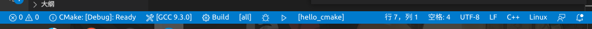

# VS Code 使用 CMake 构建项目

## 安装必要插件

* CMake
* CMake Tools
* C/C++

装好插件之后状态栏就可以看到一系列按钮，就可以愉快地使用了




## 传递参数到cmake

修改 settings.json

cmake.configureSettings 传递到 configure 阶段，即 -D 选项

cmake.buildToolArgs 传递给 make 等编译工具

```json
{
    "cmake.configureSettings": {
        "TEST": true,
        "FOO": "foo",
    },
    "cmake.buildToolArgs": [
        "-j4"
    ],
}

```