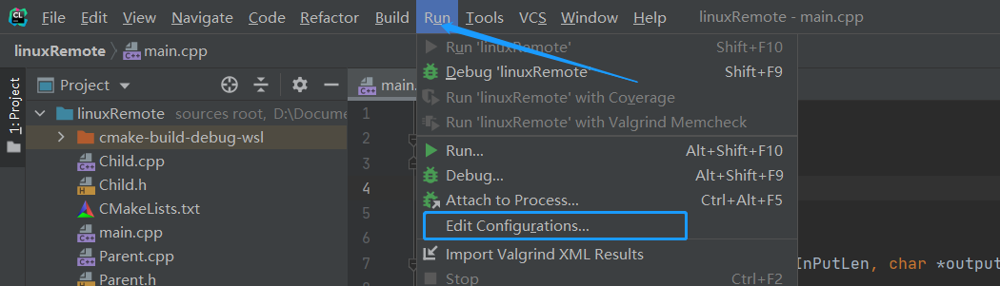
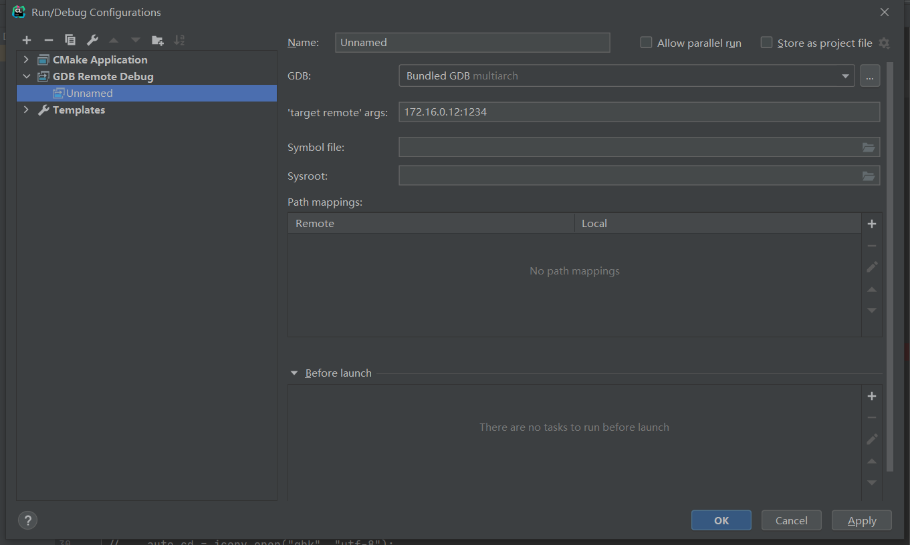
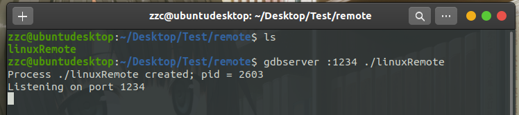
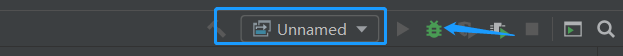
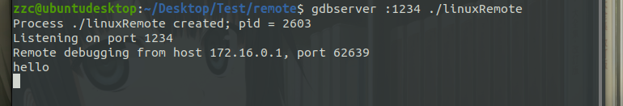
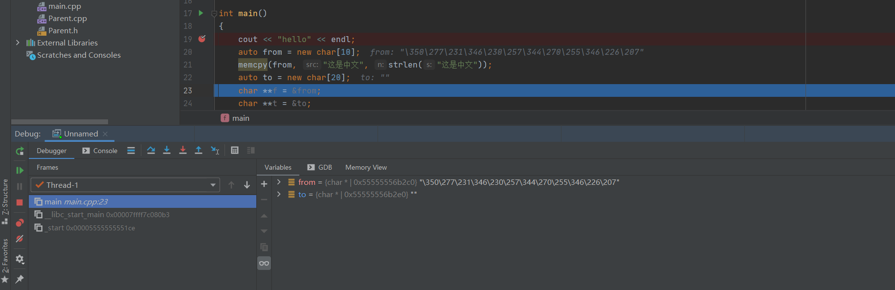
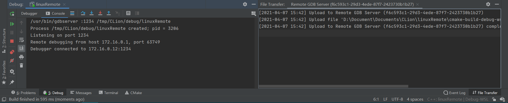
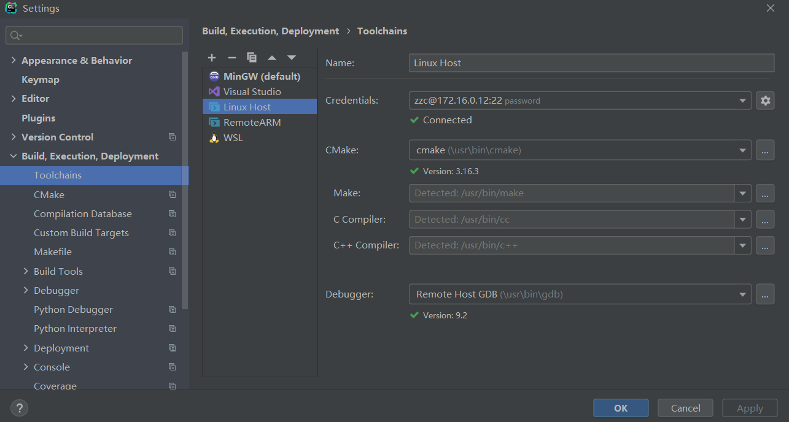

# CLion 远程开发

[toc]


# 引言

不是所有目标机器都会有开发环境，或者说有些机器直接不支持安装开发环境，这个时候就需要远程调试了。但是远程调试 gdbserver 和 GDB 的命令又太多，记不住且工作效率低，所以需要借助一定的工具，幸好 CLion 就为远程调试提供了一系列的解决方案。


## 使用 GDB/gdbserver

如目标机器上不支持开发环境的话，GDB/gdbserver 远程调试是一个不错的解决方案。将生成的二进制文件放在目标机器上通过 gdbserver 启动，就可以使用 CLion 连接上去进行调试。

CLion 为 GDB/gdbserver 远程调试提供了两种方法：即 GDB Remote Debug 和 Remote GDB Server。


### GDB Remote Debug

---

**本地操作系统**：macOS / Linux / Windows

**远程操作系统**：支持 gdbserver 的任意系统

**需要的工具**：远程系统 gdbserver

**二进制文件同步**：手动

**交叉编译**：两端系统不一致的话需要交叉编译

**调试器**：本地的 GDB

---

使用场景：已有二进制文件，即二进制文件不是由 CLion 管理和生成的

**一般步骤：**

1. 准备一个带有调试信息的二进制文件
2. 将带有调试信息的二进制文件放在远程计算机上
3. 在 CLion 中配置 GDB Remote Debug 配置；参考后面配置方法
4. 在远程计算机通过 gdbserver 启动需要调试的程序
5. 在 CLion 愉快地调试

**配置方法：**

1. Run -> Edit Configurations
   

2. 点击 ```+``` 选择 GDB Remote Debug；在 ```'target remote' args``` 填入 IP 地址和 gdbserver 启动的端口

   

**启动远程程序**

1. 将编译工具生成带调试信息的二进制文件上传到远程计算机

2. 使用 gdbserver 启动程序

   ```bash
   gdbserver :1234 $executable
   ```

   
   
3. gdbserver 会挂起等待新的连接

**启动调试**

1. 选择上面的配置并启动调试

   

2. 可以看到已经连接且命中了断点

   

   


### Remote GDB Server

---

**本地操作系统**：macOS / Linux / Windows

**远程操作系统**：支持 gdbserver 的任意系统

**需要的工具**：远程系统 SSH 和 gdbserver

**二进制文件同步**：自动

**交叉编译**：两端系统不一致的话需要交叉编译

**调试器**：本地的 GDB

---

使用场景：二进制文件全部由 CLion 本地构建并自动上传到远程系统

**配置方法：**

1. Run -> Edit Configurations

2. 点击 ```+``` 选择 Remote GDB Server；通过下拉框选择需要调试的 Target 和 Executable，Credentials 可以选择已有的 SSH 连接或新建 SSH 连接，选择完毕之后其他信息会自动带入

   

**启动调试**

1. 选择刚刚的配置并启动调试

2. 可以看到 Debug 输出为远程机器的控制台信息，且能看到文件上传；然后也能顺利命中断点

   


## 完全远程模式

---

**本地操作系统**：macOS / Linux / Windows

**远程操作系统**：Linux

**需要的工具**：远程系统编译链，SSH，rsync

**二进制文件同步**：自动

**源码位置**：本地机器，自动同步到远程机器

---

这个模式不需要本地有编译器，整套工具都是用远程机器的，且代码会上传到远程机器

**配置方法：**

1. File -> Settings -> Build, Execution, Deployment -> Toolchains

2. 点击 ```+``` 号，选择 Remote Host；填入 Credentials 信息，其他东西会自动带入

   

**启动**

1. 选择刚刚的配置
2. 跟本地开发其实没什么区别


## 参考链接

<https://www.jetbrains.com/help/clion/remote-development.html>


***
*由于个人水平有限，文中若有不合理或不正确的地方欢迎指出改正*

*文章可能更新不及时，请以[个人博客](https://zcteo.top/)处文章为准*

