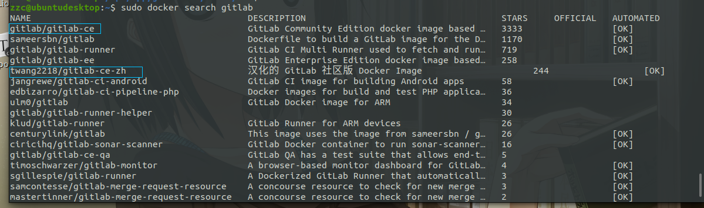

# Docker 安装 Gitlab

## 镜像查找及拉取

查找镜像

```bash
sudo docker search gitlab
```

gitlab-ce 一般是最新版本，也可以选择汉化版 gitlab-ce-zh



拉取镜像

```bash
sudo docker pull twang2218/gitlab-ce-zh
```


## 运行

```bash
sudo docker run -d  -p 443:443 -p 80:80 -p 222:22 --name gitlab --restart always \
  -v /home/gitlab/config:/etc/gitlab -v /home/gitlab/logs:/var/log/gitlab \
  -v /home/gitlab/data:/var/opt/gitlab twang2218/gitlab-ce-zh
# -d：后台运行
# -p：将容器内部端口向外映射；一般本机22号端口被ssh占用，所以映射到222
# --name：命名容器名称
# -v：将容器内数据文件夹或者日志、配置等文件夹挂载到宿主机指定目录
# --restart always docker启动的时候自动启动
```

运行成功后出现一串字符串，容器已经在后台启动


## 配置 URL

按上面的方式，gitlab容器运行没问题，但在gitlab上创建项目的时候，生成项目的URL访问地址是按容器的hostname来生成的，也就是容器的id。作为gitlab服务器，我们需要一个固定的URL访问地址，于是需要配置gitlab.rb（宿主机路径：/home/gitlab/config/gitlab.rb）文件

```bash
sudo vim /home/gitlab/config/gitlab.rb
```

里面文件内容全是注释，找到以下配置项进行配置或者直接加上以下配置

```bash
# http协议所使用的访问地址
external_url 'http://172.16.1.10'

# ssh协议所使用的访问地址
gitlab_rails['gitlab_ssh_host'] = '172.16.1.10'
# ssh端口，run时由22映射的222端口
gitlab_rails['gitlab_shell_ssh_port'] = 222
# 时区改为东八区
gitlab_rails['time_zone'] = 'Asia/Shanghai'
```

改了配置之后需要重新加载配置

方式一：直接重启容器

```bash
sudo docker restart gitlab
```

方式二：进入容器重新加载配置

```bash
# 进入容器
sudo docker exec -it gitlab bash
# 重新加载配置
gitlab-ctl reconfigure
# 退出容器
exit
```
