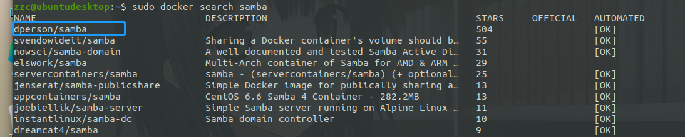

# Docker 安装 Samba

## 镜像查找及拉取

查找镜像

```bash
sudo docker search samba
```

这个星星最多，就选这个吧



拉取镜像

```bash
sudo docker pull dperson/samba
```


## 运行

```bash
sudo docker run -d --name samba -p143:143 -p445:445 --restart always -v /home/samba:/mount dperson/samba \
     -u "name;password" -s "file;/mount;no;no;no;Eric;none" -r
# -d：后台运行
# -p：将容器内部端口向外映射
# --name：命名容器名称
# -v：将容器内数据文件夹或者日志、配置等文件夹挂载到宿主机指定目录
# --restart always docker启动的时候自动启动
```

运行成功后出现一串字符串，容器已经在后台启动。

容器名字后面的参数是容器的参数，与docker无关；具体如下，请参考 [GitHub](https://github.com/dperson/samba)

```bash
sudo docker run -it --rm dperson/samba -h
Usage: samba.sh [-opt] [command]
Options (fields in '[]' are optional, '<>' are required):
    -h          This help
    -c "<from:to>" setup character mapping for file/directory names
                required arg: "<from:to>" character mappings separated by ','
    -G "<section;parameter>" Provide generic section option for smb.conf
                required arg: "<section>" - IE: "share"
                required arg: "<parameter>" - IE: "log level = 2"
    -g "<parameter>" Provide global option for smb.conf
                required arg: "<parameter>" - IE: "log level = 2"
    -i "<path>" Import smbpassword
                required arg: "<path>" - full file path in container
    -n          Start the 'nmbd' daemon to advertise the shares
    -p          Set ownership and permissions on the shares
    -r          Disable recycle bin for shares
    -S          Disable SMB2 minimum version
    -s "<name;/path>[;browse;readonly;guest;users;admins;writelist;comment]"
                Configure a share
                required arg: "<name>;</path>"
                <name> is how it's called for clients
                <path> path to share
                NOTE: for the default values, just leave blank
                [browsable] default:'yes' or 'no'
                [readonly] default:'yes' or 'no'
                [guest] allowed default:'yes' or 'no'
                NOTE: for user lists below, usernames are separated by ','
                [users] allowed default:'all' or list of allowed users
                [admins] allowed default:'none' or list of admin users
                [writelist] list of users that can write to a RO share
                [comment] description of share
    -u "<username;password>[;ID;group;GID]"       Add a user
                required arg: "<username>;<passwd>"
                <username> for user
                <password> for user
                [ID] for user
                [group] for user
                [GID] for group
    -w "<workgroup>"       Configure the workgroup (domain) samba should use
                required arg: "<workgroup>"
                <workgroup> for samba
    -W          Allow access wide symbolic links
    -I          Add an include option at the end of the smb.conf
                required arg: "<include file path>"
                <include file path> in the container, e.g. a bind mount

The 'command' (if provided and valid) will be run instead of samba

```
