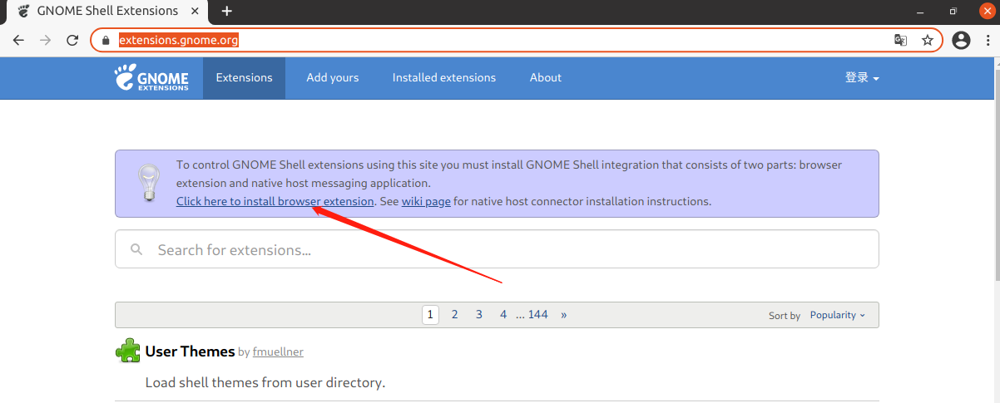
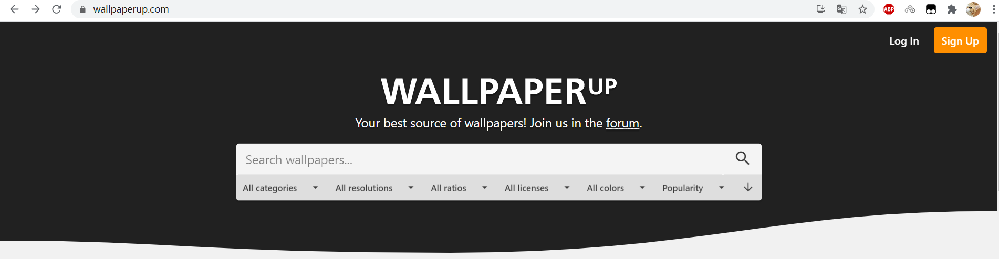
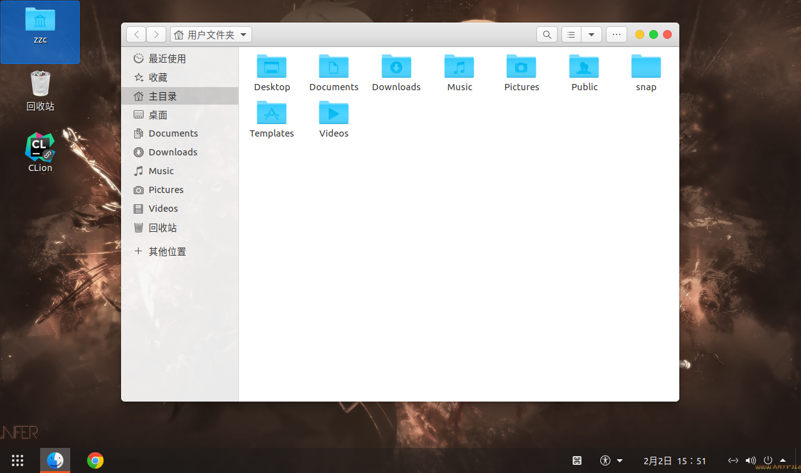

# Ubuntu 20.04 桌面美化

[TOC]

## 准备工作

下载 gnome-tweak 和 gnome-shell-extensions

```bash
sudo apt install gnome-tweak-tool
sudo apt install gnome-shell-extensions
```

打开 tweak (中文叫优化)，勾选 user themes；如果没有这个选项就注销或者重启一下


## 安装美化主题

打开 [Gnome 主题网站](https://www.gnome-look.org/)

选择 GTK3 Themes

Mac 风格的主题 [McMojave](https://www.gnome-look.org/p/1275087/)

解压下载下来的压缩包

目录复制到 /usr/share/themes/


## 安装美化图标

打开 [Gnome 主题网站](https://www.gnome-look.org/)

选择 Full Icon Themes

Mac 风格的图标 [McMojave-circle](https://www.gnome-look.org/p/1305429/)

解压下载下来的压缩包

目录复制到 /usr/share/icons/


## 使用 tweak 配置主题

根据个人情况选择自己需要的主题和图标


## 安装 Dock 扩展

### 在线安装

打开 [Gmome 扩展官网](https://extensions.gnome.org/)，根据提示点击安装浏览器扩展，chrome 需要科学访问



### 离线安装

有些情况下，机器并不能直接访问外网，或者说不能科学山上网，无法安装 Chrome 插件，就需要离线安装了

获取 gnome shell 版本

```bash
gnome-shell --version
```

根据 gnome shell 版本，选择需要下载的版本


下载后解压，将解压后的目录移到：~/.local/share/gnome-shell/extensions/ 下

打开对应扩展目录下的 metadata.json 文件，查看 uuid，重命名刚才移过来的目录名为 uuid

按 `Alt + F2` 输入 r 后按回车，重启

关闭并重新打开 tweaks，在扩展处就可以看到安装的扩展了

### dock 扩展

二选一：

> dash to dock，MAC风格
> 
> dash to panel，Windows风格


## 壁纸

推荐壁纸网站<https://www.wallpaperup.com/>




## 最终效果




