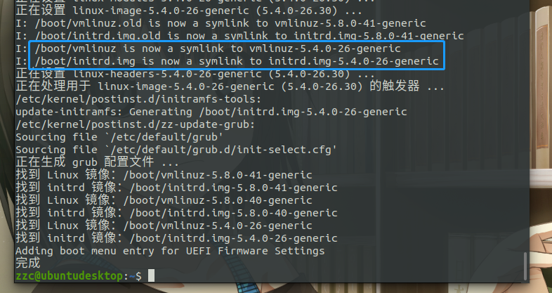

# Ubuntu 20.04 更换内核踩坑

## 引言

Ubuntu 20.04目前支持的最新内核为 5.8.0-45；但是公司有些软件必须运行在 5.4.0-26 ；所以得换内核。

然后我坑我自己；搞了好几天。


## apt 直接安装 5.4.0-26-generic

**先搜一下名字叫啥**

```bash
sudo apt search 5.4.0-26-generic
```


**安装**

安装 linux-image-5.4.0-26-generic 会提示建议安装 linux-headers-5.4.0-26-generic

既然建议，就一起装了；咱也不知道干啥的

```bash
sudo apt install linux-image-5.4.0-26-generic linux-headers-5.4.0-26-generic
```



图片说符号连接已经改了；那就重启试试


## 意外

不出意外的话现在已经出意外了，重启之后看内核，依旧还是之前的新版内核。WTF？

各种百度，各种搜索之后；发现 grub 会优先引导高版本内核。


## 手动更换 grub 引导

开机的时候按 ```Esc```，出现 grub 引导菜单后选择 ubuntu 高级选项，然后找到我们刚刚装的内核 5.4.0-26

潇洒的按下回车，提示载入 5.4.0-26 内核

然后再一次出现意外，卡在 logo 界面进不去系统

经过漫长的等待还是进不去，重启进入原来内核


## 进不去系统

换到命令行，发现 GNOME Display Manager 启动失败

遂百度 GDM 启动失败的解决方案

> 用 lightgdm 替换 gdm3
>
> 可以，没问题；刚安装的内核可以启动了，但是 lightgdm 不支持自动锁屏（公司要求必须设置自动锁屏）

继续寻找为什么 GNOME Display Manager 启动失败


## 找到 GDM 启动失败原因了

在多次重启之后，终于有一次进入 tty2 了（之前我也尝试过很多次 ```ctrl``` + ```alt``` + ```F2``` ，都没成功进入过其他tty）

然后看看为什么启动失败

```bash
sudo systemctl status gdm3.service
```

输出一大堆，没注意；只看到有超时（这时候我已经在心里打我自己好几顿了）


## GDM 启动超时

为什么呢？因为我手贱

每次关机  ```a stop job ...```  然后等 1 分 30 秒

性子急，等不了；遂百度解决方案

```bash
sudo vim /etc/systemd/system.conf
```

将 ```DefaultTimeoutStopSec``` 改为 1s

**罪魁祸首**

每次我手贱；会将 ```DefaultTimeoutStartSec``` 也改为 1s

所以**乖乖的改回去**就可以了。


## 网卡不见了！

是的；一切启动之后网卡又不见了。

各种百度，是驱动没有了

原因找到了就解决；踩了各种坑之后

参考文章[《【解决方法】ubuntu APT源升级内核 缺少驱动》](https://blog.csdn.net/weixin_45662166/article/details/108866319)；

安装modules-extra

```bash
sudo apt install linux-modules-extra-5.4.0-26-generic
```

**终于解决了！！！**


## 一个下载离线 deb 的网站

<https://launchpad.net/ubuntu>