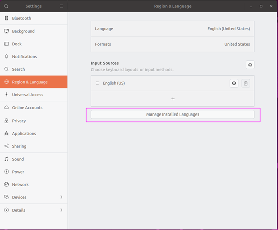

# Ubuntu 20.04 安装百度输入法

## 引言

Ubuntu 20.04 上面的搜狗输入法用起来会有一些小问题，正好百度输入法也除了 Linux 版本并开放下载，那就试试百度输入法吧。


## 准备工作

**安装小企鹅输入框架**

```bash
sudo apt update
sudo apt install fcitx
```

**安装中文支持包**

打开 setting－> Region & Language -> Input Source 下的 Manage installation Language



点击 Installation/ Remove Language


勾选中文（简体），并点击应用


keyboard input method system 选择 fcitx


点击应用到全局，然后重启


 

## 安装

**下载**

官网传送门 <https://srf.baidu.com/site/guanwang_linux/index.html>

**解压**

```bash
mkdir baidupinyin
unzip Ubuntu_Deepin-fcitx-baidupinyin-64.zip -d baidupinyin/
```

**安装**

```bash
cd baidupinyin
sudo dpkg –i fcitx-baidupinyin.deb
```

如果报错就执行下面命令

```bash
sudo apt install -f
```

**重要**

一定要安装这个，不然用不了

```bash
sudo apt install libqt5quickwidgets5
```


## 直接看这里也可以

当然，写了这么多，你也可以下载下来之后直接按照百度自己提供的文档安装也是可以的，只不过他那个安装的东西太多了，可以但没必要。


***

*由于个人水平有限，文中若有不合理或不正确的地方欢迎指出改正*

*文章可能更新不及时，请以[个人博客](https://zcteo.top/)处文章为准*

