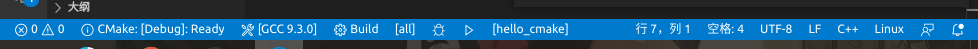

# VS Code 使用 CMake 构建项目

## 安装必要插件

* CMake
* CMake Tools
* C/C++

装好插件之后状态栏就可以看到一系列按钮，就可以愉快地使用了




## 传递参数到cmake

修改 settings.json，详见 <https://github.com/microsoft/vscode-cmake-tools/blob/main/docs/cmake-settings.md>

cmake.configureSettings 传递到 configure 阶段，即 -D 选项

cmake.parallelJobs 编译并发数，即 `make -j 25`

cmake.debugConfig 点击状态栏运行或调试按钮时的配置

- environment 环境变量
- args 传递给可执行文件的参数

```json
{
    "cmake.configureSettings": {
        "FOO": "foo",
        "TOOLS_BUILD": true
    },
    "cmake.parallelJobs": 25,
    "cmake.debugConfig": {
        "environment": [
            {
                "name": "LD_LIBRARY_PATH",
                "value": "${command:cmake.launchTargetDirectory}/lib"
            },
            {
                "name": "PATH",
                "value": "${env:PATH}:${command:cmake.launchTargetDirectory}"
            }
        ],
        "args": [
            "-c",
            "config.json"
        ]
    }
}

```
