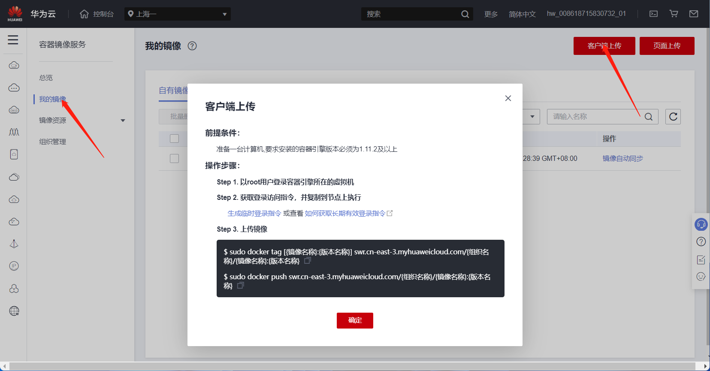

# Docker in Docker

## 前言

Docker in Docker，简称 dind，是一种在 docker 容器里面运行 docker 的方法，docker 官方镜像里面自己是有支持的，只不过 docker 现在的镜像是基于 Alpine Linux 的，我不太习惯，所以自己基于 ubuntu 20.04 做了一个 dind 镜像

**重要**

dind 方式运行容器的时候一定要加参数 `--privileged`，不然后台 docker 服务起不来


## 制作流程

### 运行 ubuntu:20.04 容器

```bash
docker pull ubuntu:20.04
docker run -itd --name ubuntu ubuntu:20.04 bash
docker exec -it ubuntu bash
```

### 容器内安装软件和配置

```bash
apt update
apt install docker.io systemd -y
# 安装完后确认一下是否已经安装 systemd，并确保/sbin/init为systemd的软链接
# ubuntu的docker.io只能通过systemd启动
```

### 修改配置

因为第一层容器已经需要运行在 docker 下了，它的文件系统一般是不支持继续运行 docker 的

#### 使用 fuse-overlayfs

 fuse-overlayfs 支持所有的 backing filesystem

安装 fuse-overlayfs

```bash
apt install fuse-overlayfs
```

修改配置文件

`/etc/docker/daemon.json` 文件内容

```json
{
    "storage-driver": "fuse-overlayfs"
}
```

#### 使用 VFS

 VFS 也支持所有的 backing filesystem，但是 VFS 文件系统是一层一层全量叠上去，很浪费空间

`/etc/docker/daemon.json` 文件内容

```json
{
    "storage-driver": "vfs"
}
```

#### 使用匿名卷

在 Dockerfile 中加入以下

```bash
VOLUME ["/var/lib/docker"]
```

### commit

```bash
docker commit ubuntu ubuntu-20.04-dind:0.0.0
```

### build

`Dockerfile`

```dockerfile
FROM ubuntu-20.04-dind:0.0.0
WORKDIR /root
# 启动systemd，这个是systemd的软链接
ENTRYPOINT ["/sbin/init"]
```

build

```bash
docker build -t ubuntu-20.04-dind:0.0.1
```


### 上传到服务器

这里以华为云为例，点击生成临时登录指令，在终端运行



```bash
docker tag ubuntu-20.04-dind:0.0.1 swr.cn-east-3.myhuaweicloud.com/zcteo/ubuntu-20.04-dind:0.0.1
docker push swr.cn-east-3.myhuaweicloud.com/zcteo/ubuntu-20.04-dind:0.0.1
```


## 下载地址

目前是 VFS 形式的

### 阿里云

```bash
docker pull registry.cn-chengdu.aliyuncs.com/zcteo/ubuntu-20.04-dind
```


### 华为云

```bash
docker pull swr.cn-east-3.myhuaweicloud.com/zcteo/ubuntu-20.04-dind
```

