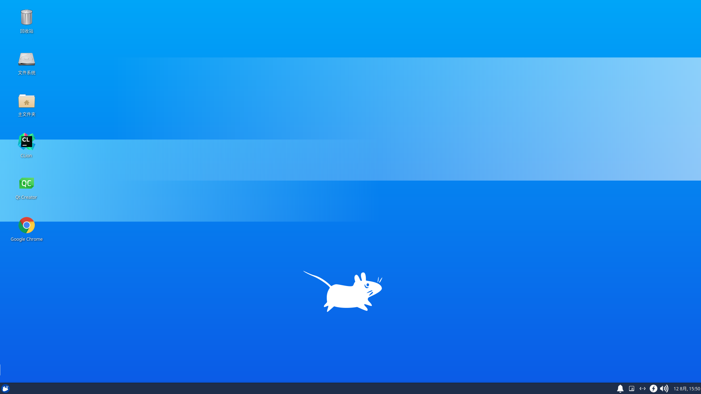
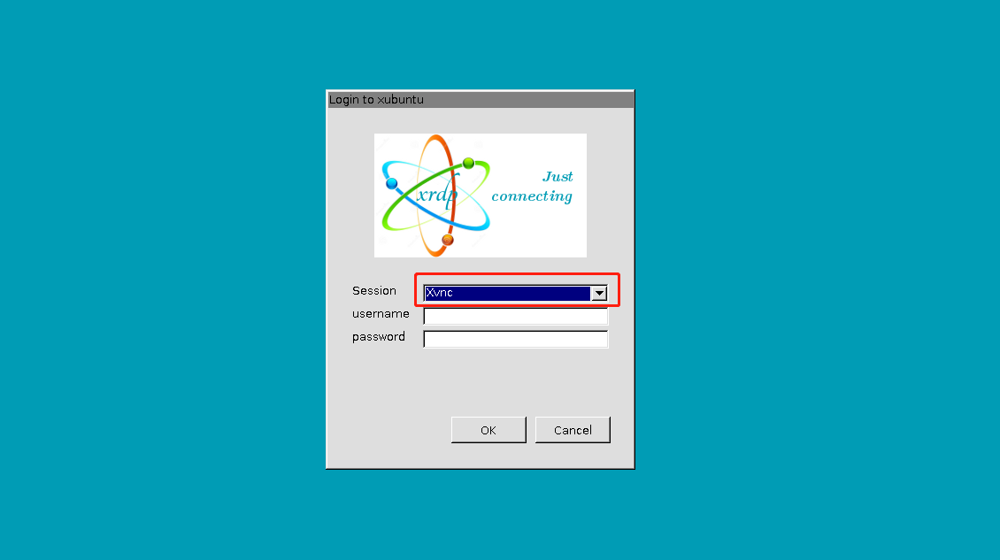
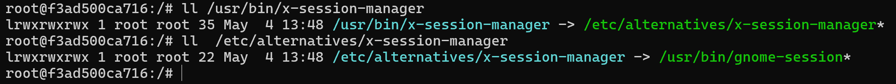

# Windows 直接远程 Linux 桌面

[toc]

## 引言

Windows 的 mstsc 是使用 RDP(Remote Desktop Protocol) 远程桌面协议的，而大部分 Linux 提供的远程桌面基本都是 VNC(Virtual Network Console) 虚拟网络控制台的，所以想要 Windows 直接访问 Linux 远程桌面的话是需要一些配置的。

桌面登录和远程登录不能同时登录，比如本地以及登录桌面了，那远程登录就会有问题或者闪退，反之亦然。


## 安装 xrdp

本文假设已经有 Linux 桌面环境了

```bash
sudo apt install xrdp
```

注销登录，退出到登录界面


## Windows 连接

使用 `win+r` 打开运行窗口，输入 mstsc 回车，打开远程桌面窗口


输入 Linux 主机的 ip 地址，点击连接，出现以下界面


登录 session 选择 xorg，输入 Linux 系统的用户名和密码点击 OK，可以看到成功进入桌面了，这时候看到的桌面背景可能和实际的不太一样



记得用完了要注销登录，而不是直接关闭远程窗口


## XRDP 使用 VNC 支持多个远程

上面的session 使用 xorg 只能支持一处登录，其他地方再登录的话会把上一个挤下来，类似 Windows 远程 Windows 的现象，XRDP 配合 VNC 的话，可以支持多处登录，然后所有客户端实时共享屏幕。

### 安装 vncserver

```bash
sudo apt install vnc4server
```

如果提示无法安装，那就安装下面这个

```bash
sudo apt install tigervnc-standalone-server
```

### Windows 连接登录

之前步骤和上面一样



登录 session 选择 xvnc，输入 Linux 系统的用户名和密码点击 OK，可以看到成功进入桌面了，这时候看到的桌面背景就和实际的一样了


然后这个还支持多个客户端同时登录，使用完毕也需要手动注销登录，不然窗口管理器那边登不上。


## 小结

装了 xrdp 之后使用 Windows 连接的话就不用额外装软件了

装桌面环境很多都是推荐 xfce4，确实比较轻，~~但是下面这句，我在有些系统没有设置也可以直接远程登录，有些系统却不行，先做个记录~~（分析了 Xsession 启动脚本后，得出下文结论）

```bash
echo xfce4-session >~/.xsession
```


Xsession 在启动的时候，如果有 `~/.xsession` 文件，则启动；否则默认启动的是 `/usr/bin/x-session-manager`；在 Ubuntu 中，有以下链接关系，由于桌面环境仅安装了 xfce4，所以 gnome-session 启动失败；同理，如果是装的其他桌面环境，无法登录的情况下，也可以在 /usr/bin 目录下找相应的 session 名称，然后写入 `~/.xsession` 文件




## 附录A 带 xfce4 桌面可远程的 Dockerfile

```dockerfile
FROM ubuntu:20.04
RUN sed -i "s@http://.*.ubuntu.com@http://mirrors.tuna.tsinghua.edu.cn@g" /etc/apt/sources.list \
    && export DEBIAN_FRONTEND=noninteractive && apt update \
    && apt install xfce4 xfce4-terminal xrdp tigervnc-standalone-server \
       ssh vim bash-completion sudo -y \
    && apt purge gnome* network-manager-gnome -y && apt autoremove -y && apt clean \
    && rm -rf /var/lib/apt/* /var/cache/apt/* /var/log/apt/* \
    && useradd -G sudo,root -m -s /bin/bash zzc
ENTRYPOINT ["/bin/bash", "-c", "service ssh start; rm -rf /var/run/xrdp/*; service xrdp start; exec sleep infinity"]
```


## 附录B 中文支持

### 安装基础库

```bash
# 安装中文字体
apt install fonts-wqy-zenhei
# 安装locales
apt install locales
```

### 正常系统做法

```bash
dpkg-reconfigure locales # 根据提示选择需要的即可
```

### Docker系统

dcoker 系统启动方式和普通系统不一样，所以单独设置

```bash
# 生成中文环境
locale-gen zh_CN.UTF-8
# 在 /etc/profile 中设置语言
export LANG=C.UTF-8 # 因为这里只想能显示中文，界面保持英文
# 如果需要将界面也改成中文的话
export LANG=zh_CN.UTF-8
export LANGUAGE=zh_CN.UTF-8
```

