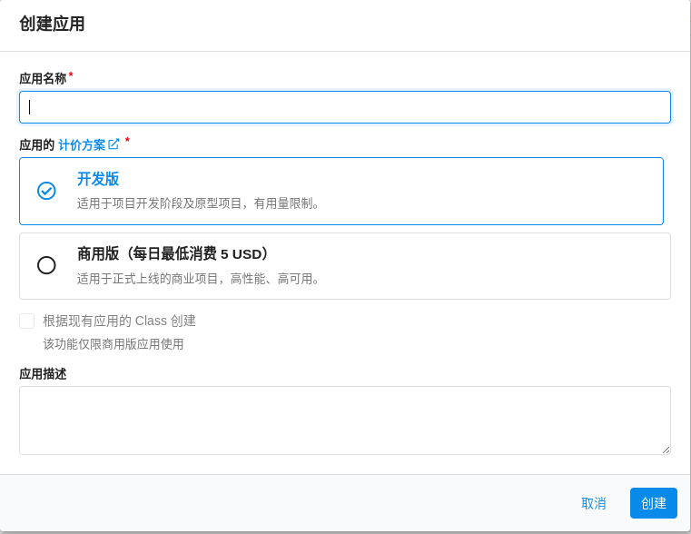
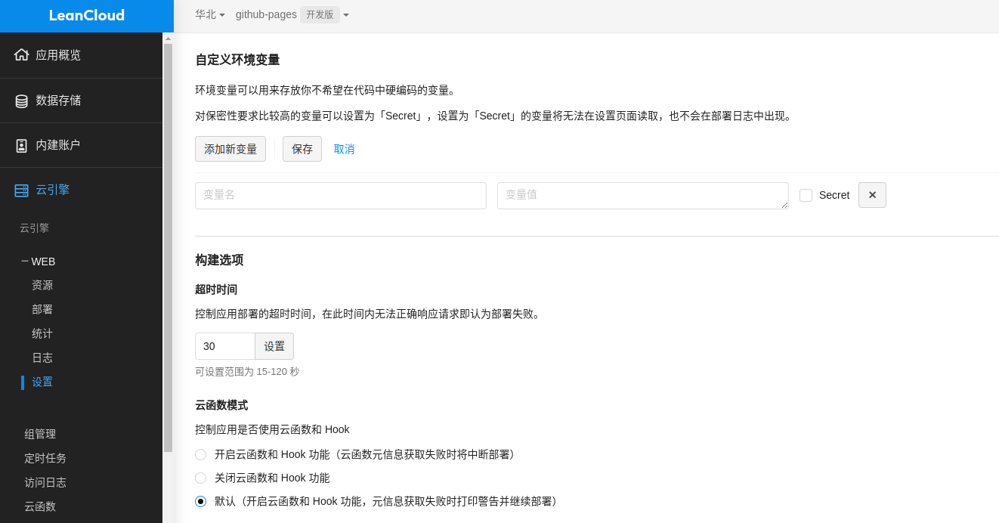

# Valine 评论系统

[TOC]

## 前言

Valine 诞生于2017年8月7日，是一款基于 [LeanCloud](https://leancloud.cn/) 的快速、简洁且高效的无后端评论系统。

这是官网 <https://valine.js.org/>，中文的，写得非常详细


## 博客引入 valine 评论系统

### 获取APP ID 和 APP Key

请先登录或注册 `LeanCloud`  [国内版](https://console.leancloud.cn/)   [国际版](https://console.leancloud.app/)

如果自己域名没有备案，就选国际版吧

进入控制台，后点击左上角创建应用




应用创建好以后，进入刚刚创建的应用，选择左下角的`设置`>`应用凭证`，然后就能看到你的`APP ID`和`APP Key`了：


### HTML 片段

修改初始化对象中的`appId`和`appKey`的值为上面刚刚获取到的值即可(其他可以默认)。
``` html
<head>
    ..
    <script src='//unpkg.com/valine/dist/Valine.min.js'></script>
    ...
</head>
<body>
    ...
    <div id="vcomments"></div>
    <script>
        new Valine({
            el: '#vcomments',
            appId: 'Your appId',
            appKey: 'Your appKey'
        })
    </script>
</body>
```


### 配置

修改初始化对象中的`appId`和`appKey`的值为上面刚刚获取到的值即可(`其他可以默认`)。
``` js
new Valine({
    el: '#vcomments' ,
    appId: 'Your appId',
    appKey: 'Your appKey'
});
```

其他详细配置项自己去官网看，<https://valine.js.org/configuration.html>


### npm

Valine 现已发布到[npm](https://www.npmjs.com/package/valine)，可以直接用命令安装：
``` bash
# Install valine
npm install valine --save
```

```js
// Use import
import Valine from 'valine';
// or Use require
const Valine = require('valine');
new Valine({
    el:'#vcomments',
    // other config
})
```


## 开启邮件通知

之前自己使用了 valine 评论系统，感觉还不错，但是吧，有人给我评论的话，我需要恰好打开那篇文章才能看到有评论，非常难受。所以需要搞一个通知啊，还好已经有很多大神开发出来了，所以就有了这一章的内容。

官网推荐的是 <https://github.com/zhaojun1998/Valine-Admin>

但是我选择的是 <https://github.com/DesertsP/Valine-Admin>，上面那个就是从这 fork 的，而且这个还有评论管理

详细部署方式可参考相关项目 github readme，我这里简单搞一下


### 准备工作

首先要绑定域名

进入创建的应用，选择左下角的`设置`>`域名绑定`，绑定自己的二级域名


如果是国内版，这里的域名必须要**备案**


### 部署

进入评论系统数据库所在的LeanCloud应用。进入「云引擎 - WEB - 设置」，设置环境变量




变量 | 示例 | 说明
--- | ------ | ---------
SITE_NAME |  | [必填]博客名称
SITE_URL  |  | [必填]首页地址 
**SMTP_SERVICE** | QQ | [新版支持]邮件服务提供商，支持 QQ、163、126、Gmail 以及 [更多](https://nodemailer.com/smtp/well-known/#supported-services) 
SMTP_USER | xxxxxx@qq.com | [必填]SMTP登录用户
SMTP_PASS | ccxxxxxxxxch | [必填]SMTP登录密码（QQ邮箱需要获取授权码，而不是登录密码） 
SENDER_NAME |  | [必填]发件人 
SENDER_EMAIL | xxxxxx@qq.com | [必填]发件邮箱
ADMIN_URL |  | [建议]Web主机二级域名（云引擎域名），用于自动唤醒 
BLOGGER_EMAIL | xxxxx@gmail.com | [可选]博主通知收件地址，默认使用SENDER_EMAIL
AKISMET_KEY |                 | [可选]Akismet Key 用于垃圾评论检测，设为MANUAL_REVIEW开启人工审核，留空不使用反垃圾


进入「云引擎 - WEB - 部署」，部署模式选择「部署项目-Git部署」，点配置 git，输入 https://github.com/DesertsP/Valine-Admin.git，选生成环境，分支master，点击部署


### 评论管理

首先需要设置管理员信息。访问管理员注册页面`https://云引擎域名/sign-up`，注册管理员登录信息

*注：使用原版 Valine 如果遇到注册页面不显示直接跳转至登录页的情况，请手动删除_User表中的全部数据。*


## 小结

上面很多东西都是直接从官方原文档摘抄出来的，valine 和 Valine-Admin 都是中文文档，推荐直接去看原文档，我这里只是简单做一下记录，有变化请以官方文档为准

