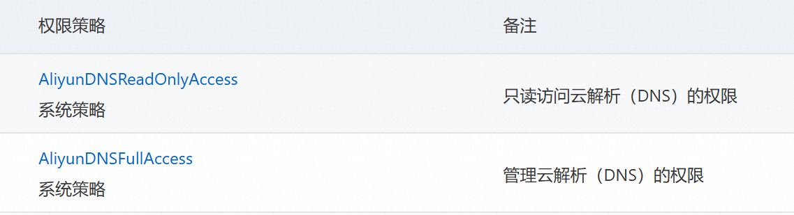

# OpenWrt 使用

[toc]

## 前言

仅在 nanopir5c 上验证过

## 交叉编译工具链

musl 工具链 https://musl.cc/

## 历史记录

一般在 `/etc/profile.d/busybox-history-file.sh`

```bash
export HISTCONTROL=ignoreboth:erasedups
```

## 安装后扩容

如使用 rk 的包格式，可以在刷写的时候修改 parameter.txt，删除 `,-@0x005c6000(opt:grow)`，确保最后一个分区有 `:grow`

我这个是 overlay 的，我不需要 opt 分区，把他全部合到 overlay 分区

```bash
# df -h
Filesystem       Size  Used Avail Use% Mounted on
tmpfs            512K     0  512K   0% /dev
tmpfs            391M  864K  390M   1% /run
overlay          1.5G  696K  1.4G   1% /
tmpfs            2.0G  5.4M  2.0G   1% /tmp
/dev/mmcblk2p10   26G   24K   25G   1% /opt

# fdisk -l
Device            Start      End  Sectors  Size Type
/dev/mmcblk2p1    16384    24575     8192    4M unknown
/dev/mmcblk2p2    24576    32767     8192    4M unknown
/dev/mmcblk2p3    32768    40959     8192    4M unknown
/dev/mmcblk2p4    40960    73727    32768   16M unknown
/dev/mmcblk2p5    73728   155647    81920   40M unknown
/dev/mmcblk2p6   155648   221183    65536   32M unknown
/dev/mmcblk2p7   221184   286719    65536   32M unknown
/dev/mmcblk2p8   286720  2908159  2621440  1.3G unknown
/dev/mmcblk2p9  2908160  6053887  3145728  1.5G unknown
/dev/mmcblk2p10 6053888 60620766 54566879   26G unknown

# parted
GNU Parted 3.6
Using /dev/mmcblk2
Welcome to GNU Parted! Type 'help' to view a list of commands.
(parted) print
Model: MMC A3A551 (sd/mmc)
Disk /dev/mmcblk2: 31.0GB
Sector size (logical/physical): 512B/512B
Partition Table: gpt
Disk Flags:

Number  Start   End     Size    File system  Name      Flags
 1      8389kB  12.6MB  4194kB               uboot
 2      12.6MB  16.8MB  4194kB               misc
 3      16.8MB  21.0MB  4194kB               dtbo
 4      21.0MB  37.7MB  16.8MB               resource
 5      37.7MB  79.7MB  41.9MB               kernel
 6      79.7MB  113MB   33.6MB               boot
 7      113MB   147MB   33.6MB               recovery
 8      147MB   1489MB  1342MB  ext4         rootfs
 9      1489MB  3100MB  1611MB  ext4         userdata
10      3100MB  31.0GB  27.9GB  ext4         opt

(parted) rm 10
(parted) resizepart 9
End?  [3100MB]? -1
(parted) unit MiB
(parted) print
Model: MMC A3A551 (sd/mmc)
Disk /dev/mmcblk2: 29600MiB
Sector size (logical/physical): 512B/512B
Partition Table: gpt
Disk Flags:

Number  Start    End       Size      File system  Name      Flags
 1      8.00MiB  12.0MiB   4.00MiB                uboot
 2      12.0MiB  16.0MiB   4.00MiB                misc
 3      16.0MiB  20.0MiB   4.00MiB                dtbo
 4      20.0MiB  36.0MiB   16.0MiB                resource
 5      36.0MiB  76.0MiB   40.0MiB                kernel
 6      76.0MiB  108MiB    32.0MiB                boot
 7      108MiB   140MiB    32.0MiB                recovery
 8      140MiB   1420MiB   1280MiB   ext4         rootfs
 9      1420MiB  29600MiB  28180MiB  ext4         userdata
(parted) quit

resize2fs /dev/mmcblk2p9 # 有一次可以，但是其他情况都不行
```

参考 [friendly 文档](https://wiki.friendlyelec.com/wiki/index.php/How_to_use_overlayfs_on_Linux/zh#.E7.A6.81.E7.94.A8OverlayFS.E7.89.B9.E6.80.A7)

```bash
# 相对于上面parted打印的大小预留了2M才成功
echo "overlayfs=enable userdata=28178" > /.init_wipedata
reboot
```

参考 [openwrt 官方文档](https://openwrt.org/docs/guide-user/advanced/expand_root)

*我的反正没成功，先写在这*

```bash
opkg install parted losetup resize2fs blkid # 25.12前
apk add parted losetup resize2fs blkid # 25.12后

wget -O expand-root.sh "https://openwrt.org/_export/code/docs/guide-user/advanced/expand_root?codeblock=0"
sh ./expand-root.sh
sh /etc/uci-defaults/70-rootpt-resize
```

## ipv6

ipv6 需要开启防火墙 wan 的 546 udp 入站

如果需要配置多个隔离的 lan 口的话，IPv6 分配长度至少设置为运营商分配 PD 前缀 +4，同时每个 lan 口设置不同的 ipv6 前缀，这样子在 ipv6 层面才是划分为不同的子网，不然仅会有一个 lan 口能获取到 ipv6 地址


## 第三方源

```ini
src/gz dllkids https://op.dllkids.xyz/packages/aarch64_generic/
```

```ini
src/gz openwrt_kiddin9 https://dl.openwrt.ai/latest/packages/aarch64_generic/kiddin9
```

*由于这两个源都没有切换到 apk, 25.12以后的版本可以看后文自行编译*

## 魔法

`HelloWorld` 的包名叫 `luci-app-ssr-plus`

## 自行编译组件

### 安装编译环境

参考 <https://openwrt.org/docs/guide-developer/toolchain/install-buildsystem>

以 Ubuntu 为例

```bash
apt install build-essential git gawk rsync unzip \
    libncurses-dev swig python3-dev python3-setuptools \
    python3-pyelftools curl
```

### 下载 SDK

<https://downloads.openwrt.org/releases/>

我的是 25.12 的 nanopi-r5c 下载链接为 <https://downloads.openwrt.org/releases/25.12.3/targets/rockchip/armv8/openwrt-sdk-25.12.3-rockchip-armv8_gcc-14.3.0_musl.Linux-x86_64.tar.zst>

### 添加第三方软件

```bash
rm -rf package/helloworld
git clone --depth=1 https://github.com/fw876/helloworld.git package/helloworld

rm -rf package/openclash
git clone --depth=1 https://github.com/vernesong/OpenClash.git package/openclash

rm -rf package/passwall-packages
git clone --depth=1 https://github.com/Openwrt-Passwall/openwrt-passwall-packages.git package/passwall-packages

rm -rf package/passwall
git clone --depth=1 https://github.com/Openwrt-Passwall/openwrt-passwall.git package/passwall

rm -rf package/passwall2
git clone --depth=1 https://github.com/Openwrt-Passwall/openwrt-passwall2.git package/passwall2
```

### 编译

#### 更新 feeds

```bash
./scripts/feeds update -a
./scripts/feeds install -a
```

#### 配置

```bash
make menuconfig
```

Global Build Settings 取消勾选好几个 "Select all xxx", 不然会勾选所有包，编译巨慢

LuCI > 2. Modules > Translations 中勾选 Simplified Chinese，不然没有中文包

LuCI > 3. Applications 中勾选并配置自己添加的包

#### 编译

```bash
make defconfig # 自动勾选依赖
make package/luci-app-ssr-plus/compile package/luci-app-openclash/compile package/luci-app-passwall/compile package/luci-app-passwall2/compile -j $(nproc)
```

### 做成本地 apk 源

不用单独每个包签名，只签名索引文件也是可以正常使用 `apk add` 安装的

#### 生成索引

**方法1 使用构建脚本**

```bash
make package/index
```

**方法2 手动生成签名索引**

适合把包全部拷贝在一起，手动生成一个完整的索引

```bash
for feed in base luci packages; do
  ./staging_dir/host/bin/apk mkndx --allow-untrusted --sign-key private-key.pem -o bin/packages/aarch64_generic/$feed/packages.adb bin/packages/aarch64_generic/$feed/*
done
```

#### 部署

将公钥 `public-key.pem` 改名后放在 `/etc/apk/keys` 目录下，注意文件名别和已有的相同

将生成索引的目录拷贝到路由器上，我这里是放在 `/data/packages` 目录下了

添加到本地源

```bash
for feed in base luci packages; do
  echo "file://data/packages/$feed/packages.adb" >> /etc/apk/repositories.d/local.list
done
```

## DDNS

### 开机自启

将 /etc/init.d/ddns 中 boot 函数删除，或者在 boot 中调用 start 函数

### 阿里云

#### 获取 AccessKey

打开 RAM 访问控制 <https://ram.console.aliyun.com/overview>

点击左侧 用户 -> 创建用户

创建用户时，勾选 “OpenAPI 调用访问”，记住 AccessKey，一次性的，页面关闭后就找不到了，一定要记住

创建完成后授予如下两个权限



#### 配置阿里云解析

<https://github.com/renndong/ddns-scripts-aliyun>

*现在官方支持阿里云了，可以直接安装 `ddns-scripts-aliyun`*

## Docker

### Config

OpenWrt docker 默认用的配置文件是 `/tmp/dockerd/daemon.json`，/tmp 目录是在内存中，修改重启路由器后就失效

该配置文件是 `/etc/init.d/dockerd` 根据 `/etc/config/dockerd` 自动生成的，需要关闭 iptables，不然映射的端口局域网内也无法访问

```
config globals 'globals'
        option data_root '/opt/docker/'
        option log_level 'warn'
        option iptables '0'
        option auto_start '1'
        list registry_mirrors 'https://mirror.xxxx.com'
```

### Storage Driver

<https://docs.docker.com/storage/storagedriver/select-storage-driver/>

默认 Storage Driver 是 vfs，这玩意有个大坑，每一层镜像都会全量保存，而不是增量保存，就会特别占用磁盘空间，在  `/etc/init.d/dockerd` 里面看了一下读取配置的代码，并不能设置 Storage Driver，我的做法是直接在 `/etc/init.d/dockerd` 内部启动 dockerd 的时候直接加参数 `--storage-driver=fuse-overlayfs`，这个需要安装 `fuse-overlayfs` 包

如果 docker 的目录是挂载的其他分区，如ext4，推荐使用 overlay2

## 附录

### 安装 ipk 包

慎重！！不保证能用

```bash
#!/bin/sh
# 检查参数
if [ -z "$1" ]; then
    echo "❌ 错误: 请指定要安装的 .ipk 文件！"
    echo "用法: $0 <文件名.ipk>"
    exit 1
fi

IPK_FILE="$1"

# 检查文件是否存在
if [ ! -f "$IPK_FILE" ]; then
    echo "❌ 错误: 找不到文件 $IPK_FILE"
    exit 1
fi

echo "🚀 开始分析并手动安装: $IPK_FILE"

# 创建临时工作目录
WORK_DIR="/tmp/ipk_extract_$(date +%s)"
mkdir -p "$WORK_DIR"
cd "$WORK_DIR" || exit 1

# 1. 解压 IPK 外壳
echo "📦 正在解压 IPK 外壳..."
tar -zxf "../$IPK_FILE" 2>/dev/null || tar -xf "../$IPK_FILE" 2>/dev/null

if [ ! -f "control.tar.gz" ] || [ ! -f "data.tar.gz" ]; then
    echo "❌ 错误: 无效的 IPK 格式，未找到 control 或 data 压缩包。"
    rm -rf "$WORK_DIR"
    exit 1
fi

# 2. 解压控制信息
echo "⚙️ 正在解析控制信息..."
mkdir -p control
tar -zxf control.tar.gz -C control/ 2>/dev/null || tar -xf control.tar.gz -C control/ 2>/dev/null

# 🔍 获取 Package 名字作为存储目录名
PKG_NAME=$(grep "^Package:" control/control | head -n1 | awk '{print $2}')
if [ -z "$PKG_NAME" ]; then
    PKG_NAME=$(basename "$IPK_FILE" .ipk)
fi
echo "📦 识别到软件包名称: $PKG_NAME"

# 创建本地卸载备份目录
RECORD_DIR="/usr/share/ipk/$PKG_NAME"
mkdir -p "$RECORD_DIR"

# 处理依赖
if [ -f "control/control" ]; then
    DEPENDS=$(grep "^Depends:" control/control | sed 's/^Depends://g' | sed 's/([^)]*)//g' | tr ',' ' ')
    if [ -n "$DEPENDS" ]; then
        echo "📡 正在处理依赖过滤与自动安装..."
        for dep in $DEPENDS; do
            case "$dep" in
                kmod-*) echo "⚠️  [跳过内核模块] -> $dep"; continue ;;
            esac
            if [ "$dep" = "kernel" ] || [ "$dep" = "libc" ] || [ "$dep" = "libgcc" ]; then
                echo "⚠️  [跳过系统基础包] -> $dep"; continue
            fi
            echo "👉 正在安装依赖: $dep ..."
            apk add "$dep" 2>/dev/null
            if [ $? -eq 0 ]; then echo "   ✅ $dep 安装成功"; else echo "   ❌ $dep 安装失败"; fi
        done
    fi
fi

# 3. 执行预安装脚本
if [ -f "control/preinst" ]; then
    echo "▶️ 正在执行预安装脚本 (preinst)..."
    chmod +x control/preinst
    (cd control && ./preinst)
fi

# 4. 解压并生成文件列表，随后拷贝
echo "🚚 正在解析并复制程序文件..."
mkdir -p data
tar -zxf data.tar.gz -C data/ 2>/dev/null || tar -xf data.tar.gz -C data/ 2>/dev/null

if [ -d "data" ] && [ "$(ls -A data)" ]; then
    # 🔍 生成完整的文件绝对路径列表（排除目录自身，只记录文件和软链接）
    (cd data && find . ! -type d | sed 's|^\.||') > "$RECORD_DIR/files"

    # 执行拷贝
    cp -af data/* / 2>/dev/null
    echo "✅ 文件复制完成。"
else
    echo "ℹ️ 数据包为空，无文件需要复制。"
    touch "$RECORD_DIR/files"
fi

# 5. 处理安装后脚本
if [ -f "control/postinst" ]; then
    echo "▶️ 正在执行安装后脚本 (postinst)..."
    chmod +x control/postinst
    (cd control && ./postinst)
fi

# 6. 备份卸载相关的脚本 (prerm 和 postrm)
[ -f "control/prerm" ] && cp -f control/prerm "$RECORD_DIR/prerm" && chmod +x "$RECORD_DIR/prerm"
[ -f "control/postrm" ] && cp -f control/postrm "$RECORD_DIR/postrm" && chmod +x "$RECORD_DIR/postrm"

# 7. 🛠️ 核心进化：自动生成该组件的一键卸载脚本
cat << 'EOF' > "$RECORD_DIR/uninstall.sh"
#!/bin/sh
LOCAL_DIR=$(dirname "$0")
PKG=$(basename "$LOCAL_DIR")

echo "🗑️  正在启动卸载流程: $PKG ..."

# A. 执行卸载前脚本
if [ -f "$LOCAL_DIR/prerm" ]; then
    echo "▶️ 正在执行卸载前脚本 (prerm)..."
    (cd "$LOCAL_DIR" && ./prerm)
fi

# B. 根据记录删除所有释放的文件
if [ -f "$LOCAL_DIR/files" ]; then
    echo "❌ 正在移除安装的文件..."
    while IFS= read -r file; do
        if [ -n "$file" ] && [ -f "$file" ] || [ -L "$file" ]; then
            rm -f "$file"
            echo "   已删除: $file"
        fi
    done < "$LOCAL_DIR/files"
fi

# C. 执行卸载后脚本
if [ -f "$LOCAL_DIR/postrm" ]; then
    echo "▶️ 正在执行卸载后脚本 (postrm)..."
    (cd "$LOCAL_DIR" && ./postrm)
fi

# D. 深度清理空目录，防止残留空文件夹
if [ -f "$LOCAL_DIR/files" ]; then
    while IFS= read -r file; do
        if [ -n "$file" ]; then
            dir=$(dirname "$file")
            # 循环向上尝试删除空目录，直到根目录或非空目录
            while [ "$dir" != "/" ] && [ "$dir" != "." ]; do
                rmdir "$dir" 2>/dev/null && echo "   已清理空目录: $dir" || break
                dir=$(dirname "$dir")
             Vigil
        fi
    done < "$LOCAL_DIR/files"
fi

# E. 自毁卸载底包目录
echo "🧹 清理卸载备份记录..."
rm -rf "$LOCAL_DIR"
echo "🎉 $PKG 卸载完成！"
EOF

chmod +x "$RECORD_DIR/uninstall.sh"

# 8. 清理临时文件
echo "🧹 正在清理临时文件..."
cd /tmp
rm -rf "$WORK_DIR"

echo "🎉 安装流程执行完毕！"
echo "ℹ️ 卸载信息已存至: $RECORD_DIR"
echo "💡 如需完全卸载此插件，只需执行: $RECORD_DIR/uninstall.sh"
```
