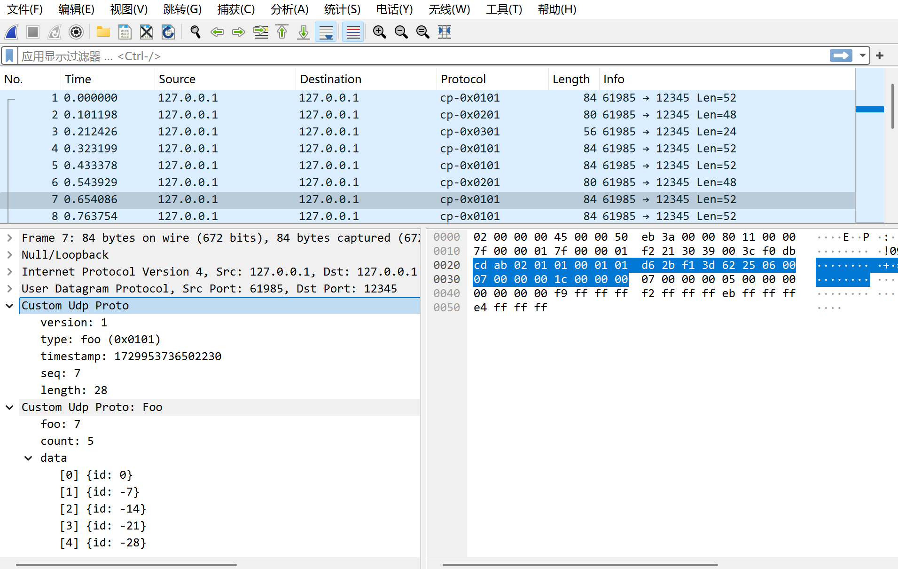

# Wireshark Lua 解析自定义协议

[TOC]

## 脚本放置位置

帮助 -> 关于 -> 文件夹；将脚本放在 lua 插件目录下，按下 `ctrl + shift +l` 即可加载


## 协议结构体

```cpp
struct Proto {
    uint32_t magic = 0x0102ABCD; // 固定值
    uint16_t version;
    uint16_t type; // 0x101-MsgTypeFoo 0x201-MsgTypeBar 0x301-length为0
    int64_t timestamp;
    uint32_t seq;
    uint32_t length;
    char payload[0];
};

struct MsgTypeFoo {
    uint32_t foo;
    uint32_t count;

    struct Data {
        int32_t id;
    } data[0];
};

struct MsgTypeBar {
    uint32_t bar;
    char data[20];
};
```


## 解析脚本

```lua
-- 创建协议，名称，描述
local proto = Proto('cp', 'Custom Udp Proto')

-- 添加字段，名称，描述，显示进制；名称可以在上方显示过滤的地方使用
local cp_version = ProtoField.uint16("cp.version", "version", base.DEC)
local cp_type_val_str = {
    [0x101] = "foo",
    [0x201] = "bar"
}
local cp_type = ProtoField.uint16("cp.type", "type", base.HEX, cp_type_val_str)
local cp_timestamp = ProtoField.uint64("cp.timestamp", "timestamp", base.DEC)
local cp_seq = ProtoField.uint32("cp.seq", "seq", base.DEC)
local cp_length = ProtoField.uint32("cp.length", "length", base.DEC)

proto.fields = { cp_version, cp_type, cp_timestamp, cp_seq, cp_length }

local foo_proto = Proto('cp.foo', 'Custom Udp Proto: Foo')
local foo_foo = ProtoField.uint32("cp.foo.foo", "foo", base.DEC)
local foo_count = ProtoField.uint32("cp.foo.count", "count", base.DEC)
foo_proto.fields = { foo_foo, foo_count }

function foo_proto.dissector(buffer, pinfo, tree)
    local subtree = tree:add(foo_proto, buffer())
    subtree:add_le(foo_foo, buffer(0, 4))
    subtree:add_le(foo_count, buffer(4, 4))
    local count = buffer(4, 4):le_uint()
    if count == 0 then
        return buffer:len()
    end
    local foo_data_tree = subtree:add(buffer(8, count * 4), "data")
    for i = 0, count - 1 do
        foo_data_tree:add_le(buffer(8 + i * 4, 4), string.format("[%d] {id: %d}", i, buffer(8 + i * 4, 4):le_int()))
    end
    return buffer:len()
end

local bar_proto = Proto('cp.bar', 'Custom Udp Proto: Bar')
local bar_bar = ProtoField.uint32("cp.bar.bar", "bar")
local bar_data = ProtoField.stringz("cp.bar.data", "data")
bar_proto.fields = { bar_bar, bar_data }

function bar_proto.dissector(buffer, pinfo, tree)
    local subtree = tree:add(bar_proto, buffer())
    subtree:add_le(bar_bar, buffer(0, 4))
    subtree:add(bar_data, buffer(4, buffer:len() - 4))
    return buffer:len()
end

local function packet_heuristic_dissector(buffer, pinfo, tree)
    local proto_length = 24
    local len = buffer:len()

    if len < proto_length then
        return false
    end

    if buffer(0, 4):le_uint() ~= 0x0102ABCD then
        return false
    end

    -- 赋值协议列
    pinfo.cols.protocol = string.format("cp-0x%04X", tostring(buffer(6, 2):le_uint()))

    -- 字段解析
    local subtree = tree:add(proto, buffer()):set_len(proto_length)
    subtree:add_le(cp_version, buffer(4, 2))
    subtree:add_le(cp_type, buffer(6, 2))
    subtree:add_le(cp_timestamp, buffer(8, 8))
    subtree:add_le(cp_seq, buffer(16, 4))
    subtree:add_le(cp_length, buffer(20, 4))
    local payload_length = buffer(20, 4):le_uint()
    if payload_length == 0 then
        return true
    end
    if len < proto_length + payload_length then
        subtree:set_text(string.format("Custom Udp Proto Error: headerLen(%d) + payloadLen(%d) > len(%d)",
                proto_length, payload_length, len))
    end
    local type = buffer(6, 2):le_uint()
    local remaining_len = len - proto_length
    local remaining_buffer = buffer(proto_length, len - proto_length):tvb()
    if type == 0x101 then
        remaining_len = remaining_len - foo_proto.dissector(remaining_buffer, pinfo, tree)
    elseif type == 0x201 then
        remaining_len = remaining_len - bar_proto.dissector(remaining_buffer, pinfo, tree)
    end
    if remaining_len > 0 then
        Dissector.get("data"):call(buffer(len - remaining_len, remaining_len):tvb(), pinfo, tree)
    end

    return true
end

-- 注册协议到udp
proto:register_heuristic("udp", packet_heuristic_dissector)
```


## 效果展示




## 附件

### 官方文档

<https://www.wireshark.org/docs/wsdg_html_chunked/>

第十章和第十一章主要讲 lua 脚本


### 测试用 pcap

<https://zcteo.github.io/pages-assitant/others/012/12345.pcap>

