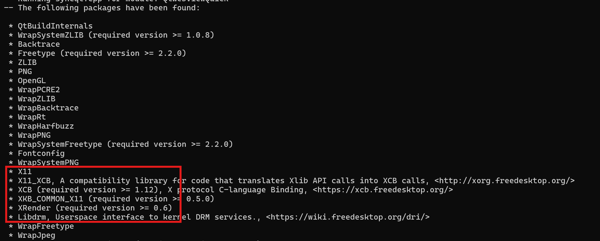

# 使用 CMake 编译 Qt 6.5

由于 qt6 开始使用 CMake 作为默认的编译配置框架，在原有的编译文章基础上新增了改文章

编译机器的版本低一点的话，兼容性会好很多，所以本文使用 Ubuntu 20.04 系统环境编译

## 基础工具

- cmake
- gcc
- g++
- make
- python3
- python3-pip


## 本机编译

### 安装依赖

现在 Ubuntu 等系统以及从 x11 切换到 Wayland 了，同时提供编译 Wayland 的方法

Wayland 只支持 OpenGL ES；不支持 OpenGL

#### Qt 库

```bash
# opengl
apt install mesa-common-dev -y
# 字体
apt install libfontconfig1-dev libfreetype6-dev -y
# alsa开发库及其工具
apt install libasound2-dev alsa-utils -y
# pulseaudio开发库及服务
apt install libpulse-dev pulseaudio -y
# 键盘
apt install libxkbcommon-dev -y
# xcb QPA 的依赖 按照qt文档来就OK https://doc.qt.io/qt-6.5/linux-requirements.html
apt install libinput-dev -y
apt install libxcb-xinput-dev -y
apt install libx11-dev -y
apt install libx11-xcb-dev -y
apt install libxext-dev -y
apt install libxfixes-dev -y
apt install libxi-dev -y
apt install libxrender-dev -y
apt install libxcb-cursor-dev -y
apt install libxcb-glx0-dev -y
apt install libxcb-keysyms1-dev -y
apt install libxcb-image0-dev -y
apt install libxcb-shm0-dev -y
apt install libxcb-icccm4-dev -y
apt install libxcb-sync-dev -y
apt install libxcb-xfixes0-dev -y
apt install libxcb-shape0-dev -y
apt install libxcb-randr0-dev -y
apt install libxcb-render-util0-dev -y
apt install libxcb-util-dev -y
apt install libxcb-xinerama0-dev -y
apt install libxcb-xkb-dev -y
apt install libxkbcommon-x11-dev -y

# Wayland
apt install libwayland-dev libwayland-egl-backend-dev
# opengles2
apt install libgles2-mesa-dev
```

#### QtWebEngine

如果不需要 QtWebEngine，直接跳过这一章

ubuntu 20 apt 直接安装的 cmake 和 nodejs 的版本达不到要求，手动安装

cmake >= 3.19 <https://cmake.org/download/>

nodejs >= 12 <https://nodejs.org/en/download/prebuilt-binaries>

```bash
pip3 install html5lib
apt install ninja-build bison flex gperf libnss3-dev libdbus-1-dev libcups2-dev -y
# x11 需要的
apt install libxcursor-dev libxcomposite-dev libxrandr-dev libxtst-dev libxshmfence-dev libxkbfile-dev libxdamage-dev -y
```

#### QtDoc

不需要文档的可以跳过，这玩意挺大的

```bash
apt install libclang-dev clang -y
```

文档如果配置成功，需要单独编译

```bash
cmake --build . --target docs -j$(nproc)
```

还需要手动拷贝到安装目录下

```
cp -ar doc/* /opt/qt6.5/doc
```


### 编译

```bash
mkdir build && cd build
cmake .. -DCMAKE_INSTALL_PREFIX=/opt/qt6.5
cmake --build . -j$(nproc)
cmake --install .
```

请确保如下配置出现在 `have been found`，不然带界面的程序在 x11 起不来



如果是 Wayland，请确认有以下带 EGL yes 的输出

```bash
Qt Wayland Drivers:
  EGL .................................... yes
  Raspberry Pi ........................... no
  DRM EGL ................................ yes
  libhybris EGL .......................... no
  Linux dma-buf server buffer integration  yes
  Shm emulation server buffer integration  yes
  Vulkan-based server buffer integration . no
```


## 交叉编译

从 qt6 开始，交叉编译必须要有对应的主机版本；如果要交叉编译 WebEngine，那主机版本也必须要有 WebEngine

### sysroot  及工具链

请参考 [交叉编译 Qt5.12](009.md)

**arm 工具链没编译成功**，因为Arm 提供的工具链没有配置 multiarch，不会去 aarch64-linux-gnu 目录下找头文件和库文件

这里下载的是 linaro 的 11.3 版本工具链：[下载链接](https://snapshots.linaro.org/gnu-toolchain/11.3-2022.06-1/aarch64-linux-gnu/gcc-linaro-11.3.1-2022.06-x86_64_aarch64-linux-gnu.tar.xz)

### 本机安装工具

如果是先编译的本机版本，之前安装的工具都够了，不需要额外安装了

#### Qt 库

交叉编译时候，本机不需要额外的工具

#### QtWebEngine

如果不需要 QtWebEngine，直接跳过这一章

cmake >= 3.19 <https://cmake.org/download/>

nodejs >= 12 <https://nodejs.org/en/download/prebuilt-binaries>

```bash
pip3 install html5lib
apt install ninja-build bison flex gperf libnss3-dev libdbus-1-dev libcups2-dev -y
```

### 编译

#### 工具链文件

```cmake
include_guard(GLOBAL)
set(CMAKE_SYSTEM_NAME Linux)
set(CMAKE_SYSTEM_PROCESSOR aarch64)
set(CMAKE_SYSROOT "/root/ubuntu")
list(APPEND CMAKE_PREFIX_PATH "/usr/lib/aarch64-linux-gnu" "/usr/lib/aarch64-linux-gnu/cmake")

set(CMAKE_C_COMPILER /opt/gcc-linaro-11.3.1-2022.06-x86_64_aarch64-linux-gnu/bin/aarch64-linux-gnu-gcc)
set(CMAKE_CXX_COMPILER /opt/gcc-linaro-11.3.1-2022.06-x86_64_aarch64-linux-gnu/bin/aarch64-linux-gnu-g++)

set(CMAKE_FIND_ROOT_PATH_MODE_PROGRAM NEVER)
set(CMAKE_FIND_ROOT_PATH_MODE_LIBRARY ONLY)
set(CMAKE_FIND_ROOT_PATH_MODE_INCLUDE ONLY)
set(CMAKE_FIND_ROOT_PATH_MODE_PACKAGE ONLY)

add_link_options("LINKER:-rpath-link,/root/ubuntu/usr/lib/aarch64-linux-gnu")
```

#### 编译命令

```bash
# 指定pkg-config查找路径
export PKG_CONFIG_PATH=/root/ubuntu/usr/lib/pkgconfig:/root/ubuntu/usr/lib/aarch64-linux-gnu/pkgconfig:/root/ubuntu/usr/share/pkgconfig

mkdir build && cd build
cmake .. -DCMAKE_INSTALL_PREFIX=/opt/qt6.5_aarch64 -DQT_HOST_PATH=/opt/qt6.5 -DCMAKE_TOOLCHAIN_FILE=/root/qt-cross-aarch64.cmake --log-level=STATUS -DINPUT_opengl=es2
cmake --build . -j$(nproc)
cmake --install .
```

### QEMU

还有一种方案就是在 QEMU 内部按照本机编译流程编译：好处是配置简单，不用配置交叉编译工具链，但是编译速度巨慢（多花了将近20倍时间）


## 参考链接

<https://doc.qt.io/qt-6.5/build-sources.html>

<https://doc.qt.io/qt-6.5/qtwebengine-platform-notes.html>
