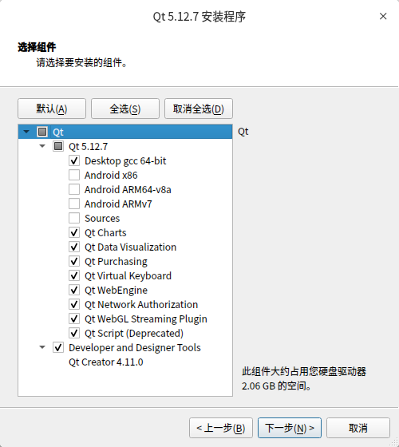

# Linux 安装 QT

[TOC]

## 下载

### Qt 官方下载

地址：<http://download.qt.io/>

*可能会打不开且下载巨慢，不详细阐述*


### 国内镜像下载

国内著名的几个 Qt 镜像网站

- 中国科学技术大学：<http://mirrors.ustc.edu.cn/qtproject/>
- 清华大学：<https://mirrors.tuna.tsinghua.edu.cn/qt/>
- 北京理工大学：<http://mirror.bit.edu.cn/qtproject/>
- 中国互联网络信息中心：<https://mirrors.cnnic.cn/qt/>

**我们以中科大镜像站为例**

打开链接可以看到


目录说明

| 目录                 | 说明                                                      |
| -------------------- | --------------------------------------------------------- |
| archive              | 各版本Qt 开发工具安装包，（可以下载 Qt 开发环境和源代码） |
| community_releases   | 社区定制的 Qt 库，Tizen 版 Qt 以及 Qt 附加源码包          |
| development_releases | 开发版，在 Qt 开发过程中的非正式版本                      |
| learning             | Qt 的文档教程和示范视频                                   |
| ministro             | Android 版本。                                            |
| official_releases    | 正式发布版，长期支持版（可以下载Qt开发环境和源代码）。    |
| online               | Qt 在线安装包                                             |
| snapshots            | 预览版，最新的开发测试中的 Qt 库和开发工具                |

我们选择下载长期支持版 5.12.7 (qt-opensource-linux-x64-5.12.7.run)


## 安装

给安装包赋予运行权限

```bash
chmod +x qt-opensource-linux-x64-5.12.7.run
```

运行

```bash
./qt-opensource-linux-x64-5.12.7.run
```

安装主界面


点击下一步输入账号密码登录；如果没有可以直接在下面注册


一直下一步，选择安装路径


下一步选择组件，一般不安装 Android 和源码




安装完成之后，需要修改default.conf，执行

```bash
sudo vim /usr/lib/x86_64-linux-gnu/qt-default/qtchooser/default.conf
```

将第一行改为自己安装路径下的bin目录的路径，第二行改为Qt5.12.3目录的路径，下面是我的配置

```
/opt/app/Qt5.12.7/5.12.7/gcc_64/bin
/opt/app/Qt5.12.7
```


### 使用 CMake 可能出现的问题

**Failed to find "GL/gl.h" in "/usr/include/libdrm"**

解决方案

```bash
sudo apt update
sudo apt install mesa-common-dev -y
```


<p align="right" style="padding-top:40px"><a href="https://zcteo.github.io/">回到首页</a></p>